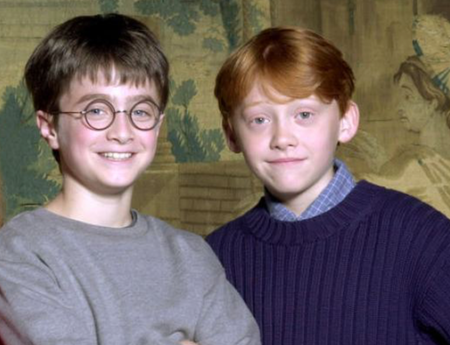
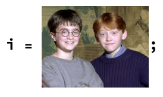

## Finding Faces

In this step, we will use inbuilt functions in the Wolfram Language to find faces in an image, and find information like the size and position of the faces.

You can work on any image which has two people, facing the camera, preferably at roughly the same distance from the camera.

Here is an image to get us started.



--- task ---
Copy/Paste or drag and drop the image into your notebook. Assign it the variable name `i`. Use a `;` after the line of code to supress the output, so that you don't get a print out of the image every time you run the code.



--- /task ---

We use the function `FindFaces` to detect the faces in the image.

We ask for exactly what we want the output of `FindFaces` to be by specifying a property of the `FindFaces` function.

`FindFaces` will always return a list of the faces it finds in the photo.

--- task ---

Use `FindFaces` to find the `"Image"` of the faces in the photo.

Assign the `"Image"` list to the variable name `faceImages`.

```
faceImages = FindFaces[i, "Image"]
```

Once you have looked at your output to check that it does what you are expecting, put a `;` after the line of code, to supress the output, so that you don't get a print out of the list of images every time you run the code.
--- /task ---

We also need to know where in the photo the faces are. We can do this using the property `"Position"`, which returns a list of the coordinates of each face in the photo.

--- task ---

Use `FindFaces` to find the `"Position"` of the faces in the photo.

Assign the `"Position"` list to the variable name `facePositions`.

```
facePositions = FindFaces[i, "Position"]
```

Once you have looked at your output to check that it does what you are expecting, put a `;` after the line of code, to supress the output, so that you don't get a print out of the list of positions every time you run the code.
---/task---


