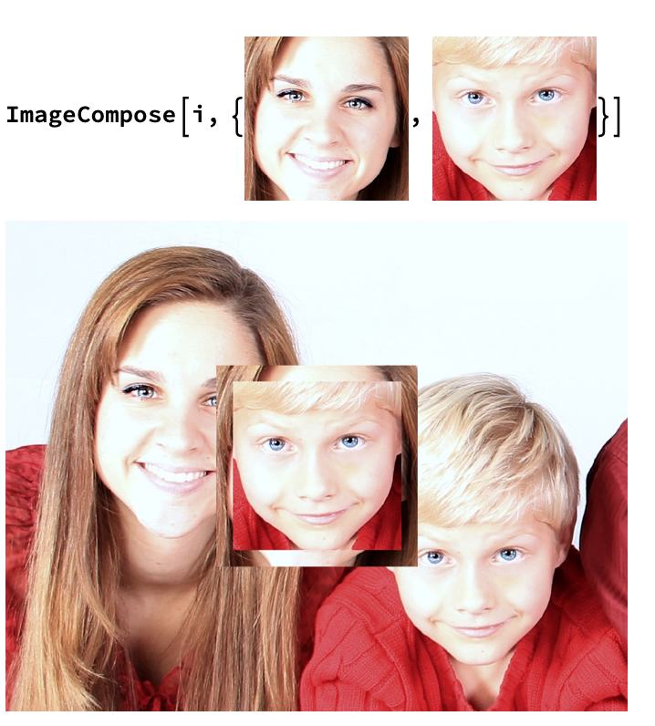
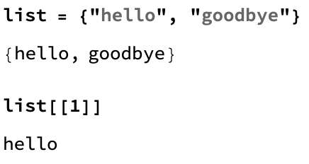
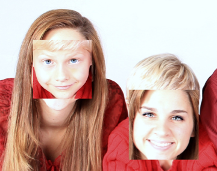

## Basic Face Swap

We can use the `ImageCompose` function to layer different images together. We want the original image as the background, and then we want the faces to be pasted on top of the image in their new positions. Let's look at how `ImageCompose` works.

`ImageCompose` takes three arguments:
+ the background image
+ a list of images to put on top of the background
+ a list of position coordinates which decide where each new image should go

If we put the background image `i`, and the images of the faces, `faceImages`, into `ImageCompose`, we can see that `ImageCompose` puts the new images right in the middle.



We need to use the `"Position"` data we found in the last step to tell `ImageCompose` where to put each image.

We want to put the first face at the location of the second face, and the second face at the location of the first place. In order to do this with `ImageCompose`, we'll need to fill in this information:

```
ImageCompose[i, {first face, second face}, {new position for first face, new position for second face}]
```
The new position for the first face will be the original position for the second face.
The new position for the second face will be the original position for the first face.

In order to extract this information from the lists `faceImages` and `facePositions`, we need to find specific parts of the lists.

We can do this using `[[]]`.

For example, if we have a list, then we can access the first item in the list by using `list[[1]]`:



---task---

Use `ImageCompose`, `faceImages` and `facePositions` to swap the positions of the faces in the image `i`.

```
ImageCompose[i, {faceImages[[1]], faceImages[[2]]}, {facePositions[[2]], facePositions[[1]]}]
```



---/task---
