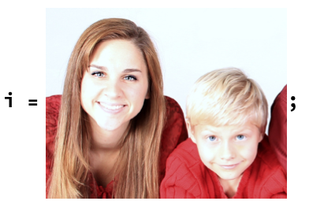

## Complete your face swap

Now you have code that finds the faces in an image, swaps their sizes, reflects the direction, and blurs the edges. To finish, you need to place the new faces into the original image.

In the **Basic face swap** step, `ImageCompose` swaps the images. Now, usethe new variables `newFace1` and `newFace2` to do the same with the edited faces.

Use the same `facePositions` from **Basic face swap**.

--- task ---
Place `newFace1` and `newFace2` into the original image, in their swapped positions, using `ImageCompose`.

--- hints ---
--- hint ---
Remember that `ImageCompose` needs the images to use, and the positions where it should place those images.

```
ImageCompose[i, {first face, second face}, {new position for first face, new position for second face}]
```
--- /hint ---
--- hint ---
This is how `ImageConpose` is used in the **Basic face swap** step:

```
ImageCompose[i, {faceImages[[1]], faceImages[[2]]}, {facePositions[[2]], facePositions[[1]]}]
```
--- /hint ---
--- hint ---
This is the finished code:

```
ImageCompose[i, {newFace1, newFace2}, {facePositions[[2]], facePositions[[1]]}]
```
--- /hint ---
--- /hints ---


---/task ---

--- task ---

Pull all of your code together, and suppress the output for each line except for `ImageCompose`.


```

This is the finished program: 

faceImages = FindFaces[i, "Image"];

facePositions = FindFaces[i, "Position"];

newFace1 = ImageEffect[ImageReflect[ImageResize[faceImages[[1]], ImageDimensions[faceImages[[2]]], Left], {"FadedFrame", Scaled[1/4]}];

newFace2 = ImageEffect[ImageReflect[ImageResize[faceImages[[2]], ImageDimensions[faceImages[[1]]], Left], {"FadedFrame", Scaled[1/4]}];

ImageCompose[i, {newFace1, newFace2}, {facePositions[[2]], facePositions[[1]]}]
  ```

---/task---

Congratulations, you have created a face swap tool! Try it out by replacing the image `i` with a different image (of two people facing the camera), for example with a photo of yourself and a friend.


